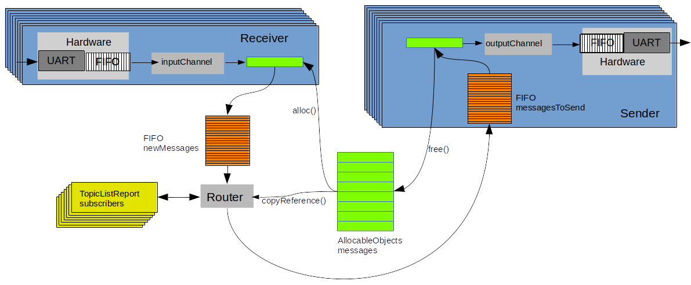
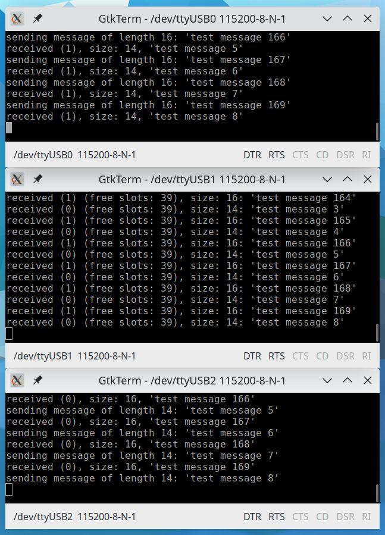

## Software Defined DMA and uartRouter

This university project contains an implementation for a router on a discovery board. It can receive messages over UART
connections, assign them to their destination connection/device and sends them out over the according UART connection.

### Structure

|                     |                                                                                                                                                  |
|---------------------|--------------------------------------------------------------------------------------------------------------------------------------------------|
| `boardConfigs`      | Configuration files for the discovery boards. Useful to flash and debug multiple devices in parallel in Clion.                                   |
| `src/clients/`      | Demo Logic for two discovery board clients which send messages and receive messages to and from the router. Not required for the router to work! |
| `src/connection.*`  | UART connection which can receive and send messages.                                                                                             |
| `src/router.*`      | Router, which assigns latest received messages to its destination UART and commands to send them.                                                |
| `misc/diagramm.odp` | Depics the router structure graphically.                                                                                                         |
| `misc/gtkterms.sh`  | Opens gtkterm debug connections for the demo setup (two clients, one router).                                                                    |

### Setup

- Make sure you pull the RODOS submodule
- If you want to debug the setup, install `gtkterm`, `OpenOCD` and `GDB` (or equivalent software)
- If you want to introduce, remove or change discoveryboards/client devices
    - Adjust the board configuration files accordingly to your own devices.
    - Adjust UART connections in `router.cpp`
    - Adjust `CMakeLists.txt`, to build an application for each device
    - Insert the topic assignments in `router.cpp/initTopics()`(defines which connection/device receives messages from
      other devices)

### Preview

